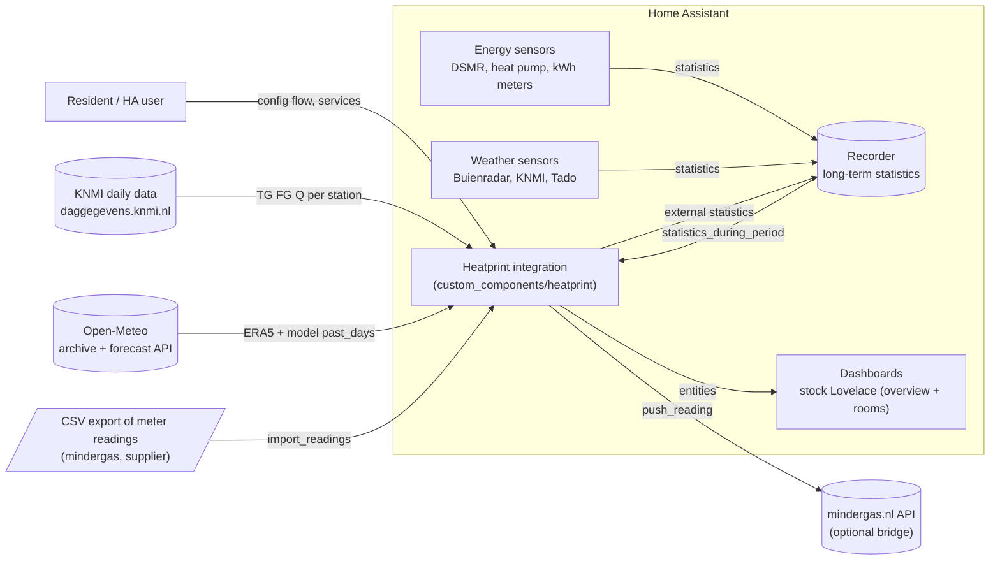
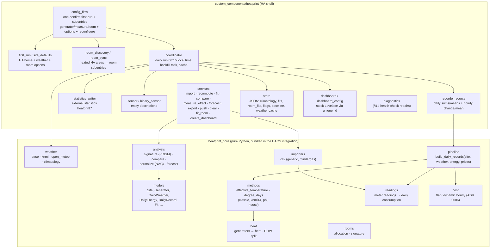
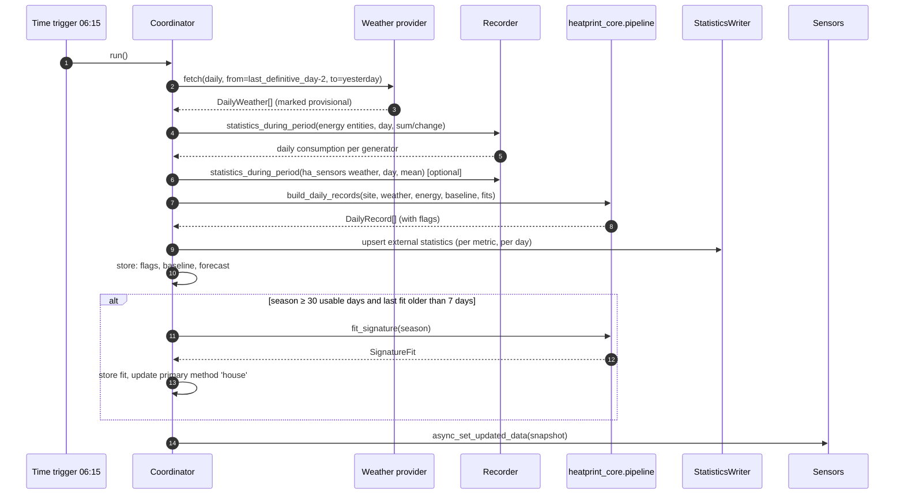

# Architecture (ARCHITECTURE)

## 1. Principles

1. **Calculation core independent of Home Assistant.** `heatprint_core` is pure Python (no HA
   imports, no heavy dependencies) and contains all formulas, providers and analyses. The HA
   integration is a thin shell: configuration, fetching data from the recorder, storage,
   entities and services. This keeps the core testable with pytest, usable in a notebook/CLI
   and later on other platforms (Homey, openHAB, a web service).
2. **The daily record as the single source of truth.** Everything is derived from one row per
   day per site (`DailyRecord`). Sensors, statistics, fits and forecasts are projections of it.
3. **History first.** External statistics make backfilling years of data possible; the
   integration also works for those who are just starting (meaningful degree days from day 1,
   fits as soon as there are 30 days).
4. **Every generator is a plug-in building block.** Gas, heat pump, electric, district heating
   and "other" share one interface: carrier → heat → (DHW, space heating).
5. **Methods side by side.** Classic (mindergas), KNMI 14 °C, PBL/KEV-SJV and house fit are
   always all computed; the user sees how the choice of method affects the conclusion.
6. **Honest about uncertainty.** Estimated heat (SCOP), provisional weather data and gaps are
   flagged and named in the UI; fits get confidence intervals.

## 2. Context diagram



## 3. Components



Responsibilities per HA module:

| Module | Does | Does not |
|---|---|---|
| `config_flow.py` | One-confirm first-run, validations, subentries (generator/measure/room), options (incl. CSV import + room sync), reconfigure. First-run weather failure is a confirm-step error + repair, not a hard abort | Calculations |
| `first_run.py` | Default weather, methods, DHW, history and rooms options | UI |
| `site_defaults.py` | HA home → name, lat/lon, time zone, country | UI |
| `room_discovery.py` | Heated HA areas → room drafts (METHODS §12.6) | Persistence |
| `room_sync.py` | Idempotent create/update of `room` subentries; preserves user overrides | Deleting missing areas |
| `dashboard.py` / `dashboard_config.py` | Create/refresh the stock Lovelace overview and Rooms dashboards; entity cards resolve `entity_id` via unique_id | Custom cards, English object-id guesses |
| `coordinator.py` | Schedules runs, fetches weather (via the core providers with HA's aiohttp session), reads the recorder, calls `pipeline.build_daily_records`, writes statistics/store, updates entities | Formulas |
| `recorder_source.py` | `statistics_during_period` per day for energy (sum/change) and weather (mean); hourly `change`/`mean` for `price_mode: dynamic` (ADR 0006) | Interpretation |
| `statistics_writer.py` | `async_add_external_statistics` with idempotent daily records; rewrites on recomputation | Reading |
| `sensor.py` | `SensorEntityDescription` per metric, value from coordinator data | Storage |
| `services.py` | Schemas, response data (`SupportsResponse.ONLY`), files under `config/heatprint/` | Calculating (delegates to the core) |
| `store.py` | `homeassistant.helpers.storage.Store` version 1 | |
| `core_api.py` | All calls into `heatprint_core` in one place (adapters from entry/options to `Site`, records, fits, forecast, import) | Formulas |
| `mindergas.py` | Client for the optional mindergas.nl bridge | |
| `diagnostics.py` | Config without tokens, last 30 daily records, flag statistics | |

## 4. Daily processing (sequence)



Backfill (at setup or after an options change) is the same pipeline over a large date range,
in blocks of 90 days, as a background task with a progress notification; KNMI requests are
made per year, Open-Meteo per 1 year (archive) plus `past_days=92` (forecast API) for the
ERA5 gap.

## 5. Data flows and storage

| Data | Where | Why |
|---|---|---|
| Configuration | config entry + subentries | HA standard, backup, UI management |
| Daily records (metrics) | external statistics | years of history, standard graphs, no recorder bloat |
| Flags, baseline, climatology, fits, forecast | `Store` JSON | small, structured, versionable |
| CSV imports | processed once → statistics | no duplicate source of truth |
| Weather cache | `Store` (last 400 days) + statistics (`t_mean`, `tac_*`) | fast recomputation without repeated API calls |

## 6. External integrations

| Source | Protocol | Auth | Limits | Fallback |
|---|---|---|---|---|
| KNMI daily data | HTTPS POST form (`start`, `end`, `stns`, `vars`) | none | fair use; 1 request/day/site + backfill | Open-Meteo |
| Open-Meteo archive/forecast | HTTPS GET JSON | none (non-commercial) | 10,000 calls/day | KNMI (NL) or HA sensors |
| HA sensors | recorder | n/a | only as long as statistics exist | - |
| mindergas.nl API | HTTPS POST JSON | API token | not retroactive | - |
| Room demand signal (Tado/`tado_ce` or compatible) | recorder (statistics/history of an existing entity) | n/a | only from when the entity's statistics/history begin | none - room omitted from allocation for that day |

Network errors: exponential backoff, `UpdateFailed` while keeping the last data;
`binary_sensor.<site>_data_gap` turns on after 3 days without usable data.
METHODS §14 health checks (`STUCK_VALUE`, `IMPLAUSIBLE_VALUE`, `SCALE_DRIFT`,
`WEATHER_STALLED`) open and auto-close HA repairs that name the generator,
room or weather source.

## 7. Package layout

```
heatprint/
├── custom_components/heatprint/      # HA shell (HACS)
│   ├── __init__.py  config_flow.py  const.py  coordinator.py
│   ├── first_run.py  site_defaults.py  dashboard.py  dashboard_config.py
│   ├── room_discovery.py  room_sync.py  history_values.py
│   ├── recorder_source.py  statistics_writer.py  store.py
│   ├── sensor.py  binary_sensor.py  services.py  services.yaml
│   ├── core_api.py  mindergas.py  diagnostics.py  issues.py
│   ├── manifest.json  strings.json
│   ├── _bundle.py                # sys.path bootstrap for the nested core
│   ├── brand/icon.png            # HACS brand icon
│   ├── translations/{en,nl}.json
│   └── heatprint_core/           # calculation core (bundled; HA-free)
│       ├── models.py  constants.py  flags.py  pipeline.py  readings.py  heat.py  dhw.py
│       ├── cost.py                 # METHODS §13 (HA-free; hourly keys are opaque)
│       ├── weather/{base,knmi,open_meteo,climatology}.py
│       ├── methods/{effective_temperature,degree_days,pbl_params}.py
│       ├── analysis/{signature,normalize,compare,forecast}.py
│       ├── health.py              # METHODS §14 threshold checks
│       ├── rooms/{allocation,signature}.py
│       └── importers/csv_readings.py
├── tests/                            # pytest (core) + fixtures
├── examples/dashboards/              # reference copies of overview + rooms
├── docs/                             # this documentation + ADRs
└── .github/workflows/                # tests, ruff, hassfest, HACS validate
```

Packaging: HACS copies only `custom_components/heatprint/` onto Home Assistant OS.
`heatprint_core` is nested in that folder so the config flow can import
`from heatprint_core import ...` without a PyPI wheel. The integration adds its own
directory to `sys.path` on load (`_bundle.py`, and the same insert in `__init__.py`
and `core_api.py`). The core stays free of Home Assistant imports (ADR 0001).
Development still uses `pip install -e .` (setuptools discovers the nested package).
Publishing `heatprint-core` to PyPI remains a later option; it is not required to
install the integration.

## 8. Quality and CI

- `pytest` for the core (formulas, synthetic dwelling, Heerlen reference case).
- `ruff` in CI (`ruff check .`). `mypy` is in the `dev` extra for local checks of
  the core; a strict mypy gate is still planned (ROADMAP open item 5) — v0.2
  shipped rooms without it.
- `hassfest` and `hacs/action` in GitHub Actions. Minimum Home Assistant is 2026.9.0
  (`hacs.json`).
- HA shell: unit tests for defaults, discovery and dashboards run under pytest;
  `pytest-homeassistant-custom-component` snapshot tests of the config flow and
  coordinator are still planned (same ROADMAP item).

## 9. Security and privacy

- No telemetry. All data stays local; external calls contain only coordinates/station and
  dates.
- mindergas token in `entry.options["integrations"]` (HA does not encrypt `.storage`;
  the token is not logged and is redacted from diagnostics).
- CSV import reads only from `config/heatprint/` or from the service payload.

## 10. Extension points (roadmap hooks)

- New weather provider: implement `WeatherProvider.fetch_daily(start, end)`.
- New generator: add a `GeneratorKind` + conversion rule in `heat.py`.
- New method: add a `DegreeDayMethod` in `methods/degree_days.py`; it is automatically
  included in daily records and sensors.
- Custom Lovelace card (v2) reads only statistics and service responses, no API of its own.
