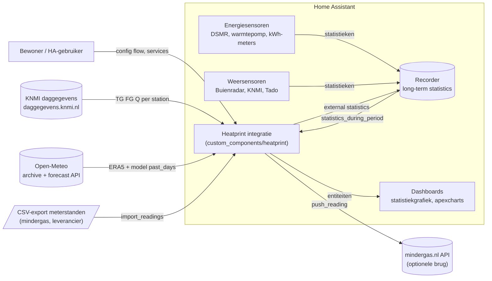
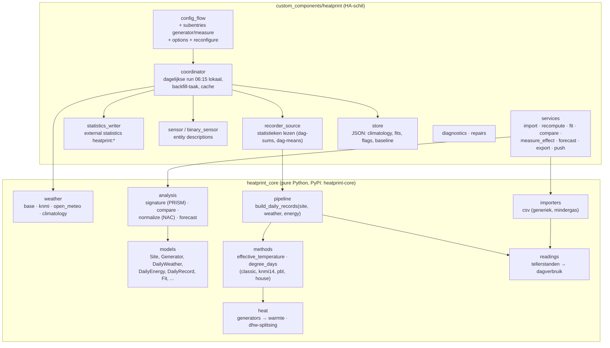
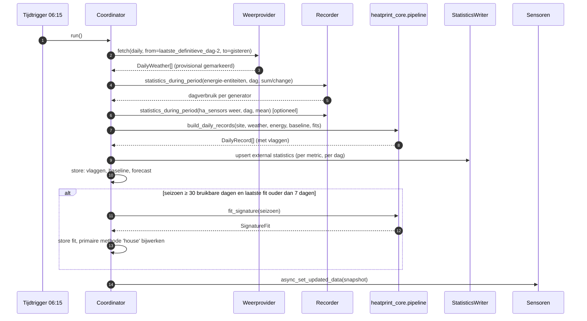

# Architectuur (ARCHITECTURE)

## 1. Uitgangspunten

1. **Rekenkern los van Home Assistant.** `heatprint_core` is pure Python (geen HA-imports, geen
   zware dependencies) en bevat alle formules, providers en analyses. De HA-integratie is een
   dunne schil: configuratie, dataophalen uit de recorder, opslag, entiteiten en services.
   Zo is de kern testbaar met pytest, bruikbaar in een notebook/CLI en later in andere
   platformen (Homey, openHAB, een webdienst).
2. **Dagrecord als enige waarheid.** Alles wordt afgeleid van één rij per dag per site
   (`DailyRecord`). Sensoren, statistieken, fits en prognoses zijn projecties daarvan.
3. **Historie eerst.** External statistics maken backfill van jaren mogelijk; de integratie
   werkt ook voor wie net begint (vanaf dag 1 zinvolle graaddagen, fits zodra 30 dagen).
4. **Elke opwekker is een plug-in bouwblok.** Gas, warmtepomp, elektrisch, warmtenet en
   "anders" delen één interface: drager → warmte → (tapwater, ruimteverwarming).
5. **Methodes naast elkaar.** Klassiek (mindergas), KNMI 14 °C, PBL/KEV-SJV en huisfit worden
   altijd alle berekend; de gebruiker ziet hoe de methodekeuze de conclusie beïnvloedt.
6. **Eerlijk over onzekerheid.** Geschatte warmte (SCOP), voorlopige weerdata en gaten worden
   gevlagd en in de UI benoemd; fits krijgen betrouwbaarheidsintervallen.

## 2. Contextdiagram



## 3. Componenten



Verantwoordelijkheden per HA-module:

| Module | Doet | Doet niet |
|---|---|---|
| `config_flow.py` | Wizard, validaties, subentries, options, reconfigure | Berekeningen |
| `coordinator.py` | Plant runs, haalt weer (via core-providers met aiohttp-sessie van HA), leest recorder, roept `pipeline.build_daily_records`, schrijft statistieken/store, update entiteiten | Formules |
| `recorder_source.py` | `statistics_during_period` per dag voor energie (sum/change) en weer (mean) | Interpretatie |
| `statistics_writer.py` | `async_add_external_statistics` met idempotente dagrecords; herschrijft bij herberekening | Lezen |
| `sensor.py` | `SensorEntityDescription` per metric, waarde uit coordinator-data | Opslag |
| `services.py` | Schema's, response-data (`SupportsResponse.ONLY`), bestanden onder `config/heatprint/` | Rekenen (delegeert naar core) |
| `store.py` | `homeassistant.helpers.storage.Store` versie 1 | |
| `core_api.py` | Alle aanroepen van `heatprint_core` op één plek (adapters van entry/opties naar `Site`, records, fits, prognose, import) | Formules |
| `mindergas.py` | Client voor de optionele mindergas.nl-brug | |
| `diagnostics.py` | Config zonder tokens, laatste 30 dagrecords, vlaggenstatistiek | |

## 4. Dagelijkse verwerking (sequence)



Backfill (bij setup of options-wijziging) is dezelfde pipeline over een groot datumbereik, in
blokken van 90 dagen, als achtergrondtaak met voortgangsmelding; KNMI-requests worden per
jaar gedaan, Open-Meteo per 1 jaar (archive) plus `past_days=92` (forecast-API) voor het
ERA5-gat.

## 5. Datastromen en opslag

| Data | Waar | Waarom |
|---|---|---|
| Configuratie | config entry + subentries | HA-standaard, backup, UI-beheer |
| Dagrecords (metrics) | external statistics | jaren historie, standaardgrafieken, geen recorder-bloat |
| Vlaggen, baseline, klimatologie, fits, forecast | `Store` JSON | klein, gestructureerd, versieerbaar |
| CSV-imports | eenmalig verwerkt → statistics | geen dubbele waarheid |
| Weer-cache | `Store` (laatste 400 dagen) + statistics (`t_mean`, `tac_*`) | snelle herberekening zonder herhaalde API-calls |

## 6. Externe koppelingen

| Bron | Protocol | Auth | Limieten | Fallback |
|---|---|---|---|---|
| KNMI daggegevens | HTTPS POST form (`start`, `end`, `stns`, `vars`) | geen | fair use; 1 request/dag/site + backfill | Open-Meteo |
| Open-Meteo archive/forecast | HTTPS GET JSON | geen (niet-commercieel) | 10.000 calls/dag | KNMI (NL) of HA-sensoren |
| HA-sensoren | recorder | n.v.t. | alleen zolang statistieken bestaan | - |
| mindergas.nl API | HTTPS POST JSON | API-token | geen terugwerkende kracht | - |

Netwerkfouten: exponentiële backoff, `UpdateFailed` met behoud van laatste data;
`binary_sensor.<site>_data_gap` gaat aan na 3 dagen zonder bruikbare data (een repair-melding
volgt in v1.0).

## 7. Package-layout

```
heatprint/
├── custom_components/heatprint/      # HA-schil (HACS)
│   ├── __init__.py  config_flow.py  const.py  coordinator.py
│   ├── recorder_source.py  statistics_writer.py  store.py
│   ├── sensor.py  binary_sensor.py  services.py  services.yaml
│   ├── core_api.py  mindergas.py  diagnostics.py  manifest.json  strings.json
│   └── translations/{en,nl}.json
├── heatprint_core/                   # rekenkern (PyPI: heatprint-core)
│   ├── models.py  constants.py  flags.py  pipeline.py  readings.py  heat.py  dhw.py
│   ├── weather/{base,knmi,open_meteo,climatology}.py
│   ├── methods/{effective_temperature,degree_days,pbl_params}.py
│   ├── analysis/{signature,normalize,compare,forecast}.py
│   └── importers/csv_readings.py
├── tests/                            # pytest (core) + fixtures
├── examples/dashboards/              # apexcharts/statistics-graph YAML
├── docs/                             # deze documentatie + ADR's
└── .github/workflows/                # tests, ruff, hassfest, HACS validate
```

Vendoring: HA laadt `heatprint_core` als `requirements` in `manifest.json`
(`heatprint-core==x.y.z`, dezelfde repo, gepubliceerd op PyPI bij elke release). Tijdens
ontwikkeling: `pip install -e .` in de devcontainer.

## 8. Kwaliteit en CI

- `pytest` voor de kern (formules, synthetische woning, referentiecase Heerlen).
- `ruff` + `mypy` (strict voor de kern).
- `hassfest` en `hacs/action` in GitHub Actions.
- HA-schil: `pytest-homeassistant-custom-component` voor config flow en coordinator
  (snapshot-tests van entiteiten) vanaf v0.2.

## 9. Beveiliging en privacy

- Geen telemetrie. Alle data blijft lokaal; externe calls bevatten alleen coördinaten/station
  en datums.
- mindergas-token in de entry (HA versleutelt `.storage` niet; token wordt niet gelogd en
  uit diagnostics geredigeerd).
- CSV-import leest alleen uit `config/heatprint/` of uit de service-payload.

## 10. Uitbreidpunten (roadmap-haken)

- Nieuwe weerprovider: implementeer `WeatherProvider.fetch_daily(start, end)`.
- Nieuwe opwekker: voeg `GeneratorKind` + conversieregel toe in `heat.py`.
- Nieuwe methode: voeg `DegreeDayMethod` toe in `methods/degree_days.py`; wordt automatisch
  meegenomen in dagrecords en sensoren.
- Custom Lovelace-kaart (v2) leest alleen statistieken en service-responses, geen eigen API.
