# Config flow (CONFIG_FLOW)

Goal: a user with gas, a heat pump, a hybrid system, all-electric heating or district heating
sets up Heatprint **within five minutes** without YAML, and can change everything later
without reinstalling.

Structure in Home Assistant (2025.3+):

- **Config entry** = one site (dwelling). Multiple sites are possible (second home).
- **Subentries** of type `generator` (heat generator) and `measure` (energy-saving measure).
- **Options flow** for methods, DHW defaults, backfill and integrations (mindergas bridge).
- **Reconfigure flow** for location and weather source.

```mermaid
flowchart TD
    A([Add integration]) --> B[Step 1: Site<br/>name, location, timezone]
    B --> C{Country = NL?}
    C -- yes --> D[Step 2a: Weather source<br/>KNMI station<br/>nearest suggested]
    C -- no --> E[Step 2b: Weather source<br/>Open-Meteo or HA sensors]
    D --> F[Step 3: Heating setup<br/>gas / hybrid / all-electric /<br/>district heating / other]
    E --> F
    F --> G[Step 4: First generator<br/>prefilled from step 3]
    G --> H{Another generator?}
    H -- yes --> G
    H -- no --> I[Step 5: DHW and cooking<br/>split method]
    I --> J[Step 6: Methods and season<br/>show defaults, adjustable]
    J --> K[Step 7: History<br/>backfill years, CSV later]
    K --> L[Summary and confirm]
    L --> M([Entry created<br/>+ generator subentries])
    M --> N[Background: weather backfill,<br/>climatology, first calculation]

    subgraph Later
        O[Subentry: add/edit generator]
        P[Subentry: add measure]
        Q[Options: methods, DHW, backfill,<br/>mindergas bridge, prices/CO2]
        R[Reconfigure: location, weather source]
        S[Service: CSV import of meter readings]
    end
    M -.-> O
    M -.-> P
    M -.-> Q
    M -.-> R
    M -.-> S
```

---

## Step 1 - Site

| Field | Type/selector | Default | Validation |
|---|---|---|---|
| `name` | text | "Home" | unique per installation |
| `location` | location selector (map) | HA home | valid lat/lon |
| `timezone` | select | HA time zone | |
| `country` | select (ISO-2) | from HA | |

Errors: `name_exists`.

## Step 2a - Weather source (NL)

| Field | Selector | Default | Notes |
|---|---|---|---|
| `provider` | select: `knmi`, `open_meteo`, `ha_sensors` | `knmi` | |
| `station_id` | select (list with name + distance) | nearest KNMI station | list of ~35 stations with lat/lon in `const.py` |
| `fallback` | select: `open_meteo`, `none` | `open_meteo` | |

Validation: KNMI test request (last 7 days). Errors: `cannot_connect`, `no_data_for_station`.

## Step 2b - Weather source (outside NL)

| Field | Selector | Default |
|---|---|---|
| `provider` | select: `open_meteo`, `ha_sensors` | `open_meteo` |
| `ha_entities.temperature` | entity (sensor, device_class temperature) | - |
| `ha_entities.wind` | entity (sensor, wind_speed) | optional |
| `ha_entities.radiation` | entity (sensor, irradiance) | optional |

Validation: Open-Meteo test request; with `ha_sensors`, a check for `state_class measurement`
(otherwise there are no long-term statistics → error `entity_no_statistics`).

## Step 3 - Heating setup (wizard choice)

One choice that prefills the next step:

| Choice | Prefilled generators |
|---|---|
| `gas` | 1× `gas_boiler` (role `both`) |
| `hybrid` | 1× `gas_boiler` (`both`) + 1× `heat_pump` (`space`) |
| `all_electric` | 1× `heat_pump` (`both`) |
| `district_heat` | 1× `district_heat` (`both`) |
| `custom` | empty |

Autodetection (suggestions, no automatic choice): sensors with `device_class: gas` and
`state_class: total_increasing` → gas; sensors with `device_class: energy` and a name containing
warmtepomp/heat pump/hp/wp → heat pump.

## Step 4 - Generator (repeating; becomes subentry `generator`)

Sub-steps depending on `kind`:

### 4.1 Kind and role

| Field | Selector | Default |
|---|---|---|
| `name` | text | per kind |
| `kind` | select | from step 3 |
| `role` | select: `space`, `dhw`, `both` | per kind |

### 4.2 Sensors

| `kind` | Required | Optional |
|---|---|---|
| `gas_boiler` | `energy_entity` (m³, total_increasing) | `dhw_entity` (rare) |
| `heat_pump` | at least one of `thermal_entity` (kWh_th) or `electric_entity` (kWh) | both; `dhw_entity` (kWh_th DHW), `dhw_electric_entity` |
| `electric_heater` | `energy_entity` (kWh) | |
| `air_to_air` | `energy_entity` (kWh) | |
| `district_heat` | `energy_entity` (GJ or kWh) | `dhw_entity` |
| `other` | `energy_entity` | |

Validation: the entity exists, `state_class` is `total` or `total_increasing`, the unit matches
the kind (m³ → gas; kWh/Wh/MWh → electric/thermal; GJ/MJ/kWh → district heating). Errors:
`entity_not_found`, `entity_not_cumulative`, `unit_mismatch`, `missing_thermal_or_electric`.

### 4.3 Conversion

| `kind` | Fields | Default |
|---|---|---|
| `gas_boiler` | `heating_value` (select Hs 8.792 / Hi 7.92 / custom), `efficiency` (0.5-1.1) | Hs, 0.95 |
| `heat_pump` | `mode` (auto: `measured_thermal` when a thermal sensor is present, otherwise `cop_fixed`), `scop` (1-7) | 3.5 |
| `air_to_air` | `cop` | 3.0 |
| `electric_heater` | - | factor 1.0 |
| `district_heat` | `efficiency` | 1.0 |
| `other` | `factor` | 1.0 |

Help text for `cop_fixed`: "Without a thermal meter the heat is an estimate;
Heatprint labels it as 'estimated'."

### 4.4 DHW/cooking (only with role `both`)

| Field | Selector | Default |
|---|---|---|
| `dhw_mode` | select: `baseline`, `fixed`, `measured`, `none` | `measured` when `dhw_entity` is set, otherwise `baseline` |
| `fixed_per_day` | number (carrier unit/day) | - |

The summer window for the baseline (`summer_window`, MM-DD, default 06-01 to 08-31) is a
site setting (step 5 and options), not a per-generator one.

### 4.5 Price and CO₂ (optional, collapsible)

| Field | Selector | Default |
|---|---|---|
| `price_entity` | entity (sensor) | - |
| `co2_factor` | number | per kind (gas 1.78 kg/m³; electricity 0.30 kg/kWh or a CO₂ sensor) |

After 4.5: "Add another generator?" (yes → 4.1).

## Step 5 - DHW and cooking (site level)

Only a summary and an optional override of the default from 4.4; plus an explanation of why
the split matters for the heating line.

## Step 6 - Methods and season

| Field | Selector | Default |
|---|---|---|
| `season_start` | select: `1 October` (gas year), `1 January`, `1 July` | 1 October |
| `methods.enabled` | multi-select: `classic`, `knmi14`, `pbl`, `house` | classic, pbl, house |
| `methods.primary` | select | `house` |
| `classic.weighted` | boolean | true |
| `classic.base_temp`, `classic.heating_limit` | number | 18.0 / 18.0 |
| `pbl.parameter_set` | select: `practical`, `optimal` | practical |
| `pbl.wind_mode` | select: `linear`, `sqrt` | linear |
| `pbl.include_sun` | boolean | false (only when radiation is available) |
| `house.fit_wind` | boolean | true |

Advanced fields live under "Advanced" (collapsed section).

## Step 7 - History

| Field | Selector | Default |
|---|---|---|
| `backfill_years` | number 0-10 | 3 |
| `climatology_years` | number 10-30 | 20 |
| `import_now` | boolean | false; shows an explanation of `heatprint.import_readings` |

Text: "Weather history is fetched in the background. Meter readings from before your Home
Assistant history can be imported with the action 'Import meter readings' (CSV, for example
the export of mindergas.nl)."

## Summary

Shows site, weather source, generators with role/conversion/DHW, methods, season, backfill.
Confirm → create entry + subentries → coordinator starts the backfill task (with progress as
a repair/notification).

---

## Subentry flows

### `generator` (add / edit / remove)

Same steps as 4.1-4.5. Changing `energy_entity` triggers a recomputation from the earliest
available date of the new sensor. Removing: the statistics of that generator are kept
(history) but are no longer updated. Home Assistant has no removal flow for subentries with
questions of its own, so "also clear statistics" is a separate service
(`heatprint.clear_statistics`) instead of a checkbox.

### `measure` (add / edit / remove)

| Field | Selector |
|---|---|
| `name` | text |
| `date` | date |
| `category` | select: `insulation`, `installation`, `behaviour`, `other` |
| `notes` | text (multiline) |

After creation the service `heatprint.measure_effect` can be called (only meaningful
once there are ≥ 30 days after the date). A dedicated "Compute effect" button after
the subentry is created is a v1.0 UI polish; the service is already wired.

---

## Options flow

Sections (menu):

1. **Methods and season** - same fields as step 6.
2. **DHW and cooking** - defaults and summer window.
3. **History** - backfill/climatology years; button "recompute from date".
4. **Prices and CO₂** - default factors, CO₂ sensor.
5. **Integrations** - mindergas.nl bridge: API token (password field), generator choice,
   daily push on/off. The token lives in the config entry (Home Assistant does not
   encrypt `.storage`); it is never logged and is redacted from diagnostics (ARCHITECTURE §9).
6. **Advanced** - override PBL parameters (TST/RER/TOP per month group) and wind
   coefficient; outlier threshold; minimum number of days for a fit.

## Reconfigure flow

Location, timezone, weather source/station. On a station change: fetch the weather history
again and recompute all daily records (with confirmation).

---

## Migrations and versions

- `version = 1`, `minor_version = 0`. Subentries require HA 2025.3+; on older HA the
  integration refuses to load with a clear repair notification (the HACS minimum is in
  `hacs.json`).
- Future fields get default values in `async_migrate_entry`.

## Strings and translations

All labels, descriptions and errors live in `strings.json` + `translations/en.json` and
`translations/nl.json`. Show a short "why" text (description) with every technical field, so
that the user understands the choice (for example why 18 °C is not sacred).
