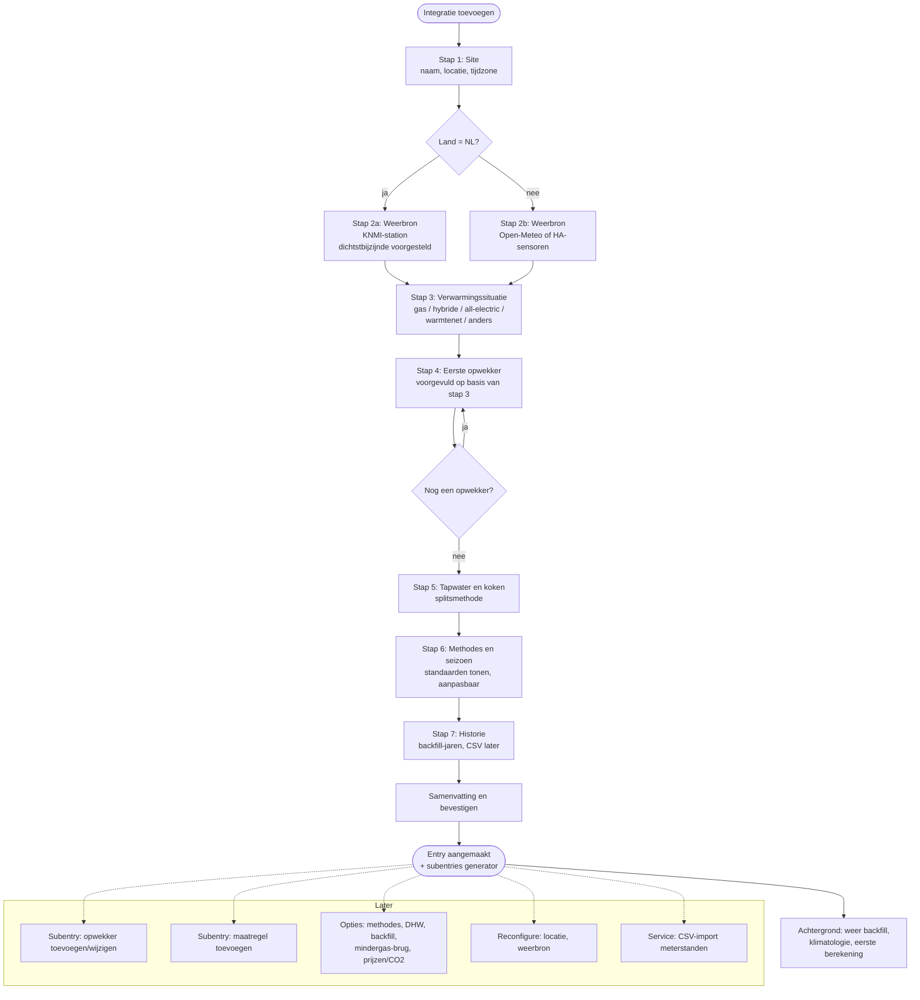

# Config flow (CONFIG_FLOW)

Doel: een gebruiker met gas, warmtepomp, hybride, elektrisch of warmtenet richt Heatprint in
**binnen vijf minuten** zonder YAML, en kan alles later aanpassen zonder herinstallatie.

Structuur in Home Assistant (2025.3+):

- **Config entry** = één site (woning). Meerdere sites mogelijk (tweede huis).
- **Subentries** van type `generator` (warmteopwekker) en `measure` (besparingsmaatregel).
- **Options flow** voor methodes, DHW-standaarden, backfill en integraties (mindergas-brug).
- **Reconfigure flow** voor locatie en weerbron.

---

## Stap 1 - Site

| Veld | Type/selector | Standaard | Validatie |
|---|---|---|---|
| `name` | text | "Thuis" | uniek per installatie |
| `location` | location-selector (kaart) | HA home | lat/lon geldig |
| `timezone` | select | HA-tijdzone | |
| `country` | select (ISO-2) | uit HA | |

Fouten: `name_exists`.

## Stap 2a - Weerbron (NL)

| Veld | Selector | Standaard | Toelichting |
|---|---|---|---|
| `provider` | select: `knmi`, `open_meteo`, `ha_sensors` | `knmi` | |
| `station_id` | select (lijst met naam + afstand) | dichtstbijzijnde KNMI-station | lijst van ~35 stations met lat/lon in `const.py` |
| `fallback` | select: `open_meteo`, `none` | `open_meteo` | |

Validatie: testrequest KNMI (laatste 7 dagen). Fouten: `cannot_connect`, `no_data_for_station`.

## Stap 2b - Weerbron (buiten NL)

| Veld | Selector | Standaard |
|---|---|---|
| `provider` | select: `open_meteo`, `ha_sensors` | `open_meteo` |
| `ha_entities.temperature` | entity (sensor, device_class temperature) | - |
| `ha_entities.wind` | entity (sensor, wind_speed) | optioneel |
| `ha_entities.radiation` | entity (sensor, irradiance) | optioneel |

Validatie: Open-Meteo testrequest; bij `ha_sensors` controle op `state_class measurement`
(anders geen long-term statistics → fout `entity_no_statistics`).

## Stap 3 - Verwarmingssituatie (wizard-keuze)

Eén keuze die de volgende stap voorvult:

| Keuze | Voorgevulde opwekkers |
|---|---|
| `gas` | 1× `gas_boiler` (role `both`) |
| `hybrid` | 1× `gas_boiler` (`both`) + 1× `heat_pump` (`space`) |
| `all_electric` | 1× `heat_pump` (`both`) |
| `district_heat` | 1× `district_heat` (`both`) |
| `custom` | leeg |

Autodetectie (suggesties, geen automatische keuze): sensoren met `device_class: gas` en
`state_class: total_increasing` → gas; sensoren met `device_class: energy` en naam bevat
warmtepomp/heat pump/hp/wp → warmtepomp.

## Stap 4 - Opwekker (herhalend; wordt subentry `generator`)

Sub-stappen afhankelijk van `kind`:

### 4.1 Soort en rol

| Veld | Selector | Standaard |
|---|---|---|
| `name` | text | per soort |
| `kind` | select | uit stap 3 |
| `role` | select: `space`, `dhw`, `both` | per soort |

### 4.2 Sensoren

| `kind` | Verplicht | Optioneel |
|---|---|---|
| `gas_boiler` | `energy_entity` (m³, total_increasing) | `dhw_entity` (zelden) |
| `heat_pump` | minstens één van `thermal_entity` (kWh_th) of `electric_entity` (kWh) | beide; `dhw_entity` (kWh_th tapwater), `dhw_electric_entity` |
| `electric_heater` | `energy_entity` (kWh) | |
| `air_to_air` | `energy_entity` (kWh) | |
| `district_heat` | `energy_entity` (GJ of kWh) | `dhw_entity` |
| `other` | `energy_entity` | |

Validatie: entity bestaat, `state_class` is `total` of `total_increasing`, eenheid past bij
soort (m³ → gas; kWh/Wh/MWh → elektrisch/thermisch; GJ/MJ/kWh → warmtenet). Fouten:
`entity_not_found`, `entity_not_cumulative`, `unit_mismatch`, `missing_thermal_or_electric`.

### 4.3 Conversie

| `kind` | Velden | Standaard |
|---|---|---|
| `gas_boiler` | `heating_value` (select Hs 8,792 / Hi 7,92 / custom), `efficiency` (0,5-1,1) | Hs, 0,95 |
| `heat_pump` | `mode` (auto: `measured_thermal` als thermische sensor aanwezig, anders `cop_fixed`), `scop` (1-7) | 3,5 |
| `air_to_air` | `cop` | 3,0 |
| `electric_heater` | - | factor 1,0 |
| `district_heat` | `efficiency` | 1,0 |
| `other` | `factor` | 1,0 |

Toelichtingstekst bij `cop_fixed`: "Zonder thermische teller is de warmte een schatting;
Heatprint labelt die als 'geschat'."

### 4.4 Tapwater/koken (alleen bij role `both`)

| Veld | Selector | Standaard |
|---|---|---|
| `dhw_mode` | select: `baseline`, `fixed`, `measured`, `none` | `measured` als `dhw_entity` gezet, anders `baseline` |
| `fixed_per_day` | number (dragereenheid/dag) | - |
| `summer_window` | twee datums MM-DD | 06-01 t/m 08-31 |

### 4.5 Prijs en CO₂ (optioneel, uitklapbaar)

| Veld | Selector | Standaard |
|---|---|---|
| `price_entity` | entity (sensor) | - |
| `co2_factor` | number | per soort (gas 1,78 kg/m³; stroom 0,30 kg/kWh of CO₂-sensor) |

Na 4.5: "Nog een opwekker toevoegen?" (ja → 4.1).

## Stap 5 - Tapwater en koken (site-niveau)

Alleen samenvatting en eventuele overrule van de standaard uit 4.4; plus uitleg waarom de
splitsing belangrijk is voor de verwarmingslijn.

## Stap 6 - Methodes en seizoen

| Veld | Selector | Standaard |
|---|---|---|
| `season_start` | select: `1 oktober` (gasjaar), `1 januari`, `1 juli` | 1 oktober |
| `methods.enabled` | multi-select: `classic`, `knmi14`, `pbl`, `house` | classic, pbl, house |
| `methods.primary` | select | `house` |
| `classic.weighted` | boolean | true |
| `classic.base_temp`, `classic.heating_limit` | number | 18,0 / 18,0 |
| `pbl.parameter_set` | select: `practical`, `optimal` | practical |
| `pbl.wind_mode` | select: `linear`, `sqrt` | linear |
| `pbl.include_sun` | boolean | false (alleen als straling beschikbaar) |
| `house.fit_wind` | boolean | true |

Geavanceerde velden staan onder "Geavanceerd" (collapsed section).

## Stap 7 - Historie

| Veld | Selector | Standaard |
|---|---|---|
| `backfill_years` | number 0-10 | 3 |
| `climatology_years` | number 10-30 | 20 |
| `import_now` | boolean | false; toont uitleg over `heatprint.import_readings` |

Tekst: "Weerhistorie wordt op de achtergrond opgehaald. Meterstanden van vóór je Home
Assistant-historie importeer je met de actie 'Meterstanden importeren' (CSV, bijvoorbeeld
de export van mindergas.nl)."

## Samenvatting

Toont site, weerbron, opwekkers met rol/conversie/DHW, methodes, seizoen, backfill.
Bevestigen → entry + subentries aanmaken → coordinator start backfill-taak (met voortgang als
repair/notification).

---

## Subentry flows

### `generator` (toevoegen / wijzigen / verwijderen)

Zelfde stappen als 4.1-4.5. Wijzigen van `energy_entity` triggert herberekening vanaf de
vroegste beschikbare datum van de nieuwe sensor. Verwijderen: statistieken van die generator
blijven bestaan (historie), maar worden niet meer bijgewerkt. Home Assistant kent geen
verwijder-flow voor subentries met eigen vragen, dus "ook statistieken wissen" wordt een
aparte service (`heatprint.clear_statistics`, v0.2) in plaats van een vinkje.

### `measure` (toevoegen / wijzigen / verwijderen)

| Veld | Selector |
|---|---|
| `name` | text |
| `date` | date |
| `category` | select: `insulation`, `installation`, `behaviour`, `other` |
| `notes` | text (multiline) |

Na aanmaken: knop/melding "Effect berekenen" (service `heatprint.measure_effect`), pas
zinvol als er ≥ 30 dagen na de datum zijn.

---

## Options flow

Secties (menu):

1. **Methodes en seizoen** - zelfde velden als stap 6.
2. **Tapwater en koken** - standaarden en zomervenster.
3. **Historie** - backfill/klimatologie-jaren; knop "opnieuw berekenen vanaf datum".
4. **Prijzen en CO₂** - standaardfactoren, CO₂-sensor.
5. **Integraties** - mindergas.nl-brug: API-token (wachtwoordveld), generator-keuze,
   dagelijks pushen aan/uit. Token wordt versleuteld in de entry opgeslagen; nooit gelogd.
6. **Geavanceerd** - PBL-parameters (TST/RER/TOP per maandgroep) en windcoëfficiënt
   overschrijven; uitschieterdrempel; minimale dagen voor fit.

## Reconfigure flow

Locatie, tijdzone, weerbron/station. Bij stationwissel: weerhistorie opnieuw ophalen en
alle dagrecords herberekenen (met bevestiging).

---

## Migraties en versies

- `version = 1`, `minor_version = 0`. Subentries vanaf HA 2025.3; op oudere HA weigert de
  integratie te laden met een duidelijke repair-melding (HACS-minimum staat in `hacs.json`).
- Toekomstige velden krijgen standaardwaarden in `async_migrate_entry`.

## Teksten en vertalingen

Alle labels, beschrijvingen en fouten in `strings.json` + `translations/en.json` en
`translations/nl.json`. Toon bij elk technisch veld een korte "waarom"-tekst (beschrijving),
zodat de gebruiker de keuze begrijpt (bijvoorbeeld waarom 18 °C niet heilig is).
