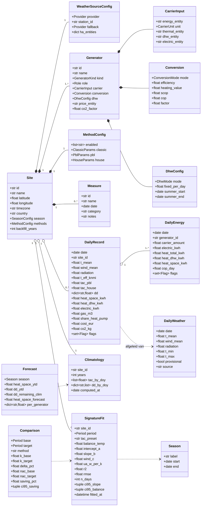

# Datamodel (DATA_MODEL)

Het datamodel heeft drie lagen:

1. **Configuratie** - wat de gebruiker instelt (site, weerbron, opwekkers, methodes, maatregelen).
   In Home Assistant opgeslagen als config entry + subentries.
2. **Feiten** - berekende dagrecords en klimatologie. In Home Assistant opgeslagen als
   external long-term statistics (`heatprint:<site>_<metric>`) plus een compacte JSON-store voor
   fits en vlaggen.
3. **Afgeleiden** - fits, vergelijkingen, prognoses. Berekend on-demand of dagelijks, gecached.

---

## 1. Configuratie-entiteiten

### 1.1 Site (config entry)

| Veld | Type | Standaard | Toelichting |
|---|---|---|---|
| `id` | slug | uit naam | Gebruikt in statistic ids: `heatprint:<id>_...` |
| `name` | str | "Thuis" | |
| `latitude`, `longitude` | float | HA-home | Voor stationkeuze en Open-Meteo |
| `timezone` | str | HA-tijdzone | Dagbegrenzing |
| `country` | ISO-2 | uit HA | Bepaalt standaardprovider (NL → KNMI) |
| `season.start_month`, `season.start_day` | int | 10, 1 | Stookseizoen/gasjaar; 1 januari mogelijk (mindergas-stijl kalenderjaar) |
| `methods` | MethodConfig | zie 1.5 | |
| `backfill_years` | int 0-10 | 3 | Hoeveel jaar weer + klimatologie terughalen bij setup |
| `climatology_years` | int | 20 | Referentiejaren voor klimatologie |
| `weather` | WeatherSourceConfig | | |

### 1.2 WeatherSourceConfig

| Veld | Type | Toelichting |
|---|---|---|
| `provider` | `knmi` / `open_meteo` / `ha_sensors` | |
| `station_id` | str | KNMI-stationnummer (bijv. `380` Maastricht); auto-suggestie op afstand |
| `fallback` | provider of `none` | Bij storing of buiten NL |
| `ha_entities.temperature` | entity_id | Alleen `ha_sensors` |
| `ha_entities.wind` | entity_id | optioneel |
| `ha_entities.radiation` | entity_id | optioneel |

### 1.3 Generator (subentry type `generator`)

| Veld | Type | Toelichting |
|---|---|---|
| `id` | slug | |
| `name` | str | "CV-ketel", "Warmtepomp" |
| `kind` | `gas_boiler` / `heat_pump` / `electric_heater` / `air_to_air` / `district_heat` / `other` | |
| `role` | `space` / `dhw` / `both` | Hybride: ketel `both`, WP `space` (of `both` als WP tapwater doet) |
| `carrier.energy_entity` | entity_id | Cumulatieve teller (m³, kWh, GJ); `state_class total_increasing` |
| `carrier.unit` | `m3` / `kwh` / `gj` | Afgeleid van de sensor, overschrijfbaar |
| `carrier.thermal_entity` | entity_id | WP thermische energie (kWh), optioneel |
| `carrier.electric_entity` | entity_id | WP elektrische energie (kWh); voor WP is `energy_entity` = elektrisch |
| `carrier.dhw_entity` | entity_id | Gemeten tapwater-energie, optioneel |
| `conversion.mode` | `fixed_efficiency` / `measured_thermal` / `cop_fixed` / `cop_curve` / `factor` | |
| `conversion.efficiency` | float | ketel 0,95; warmtenet 1,0 |
| `conversion.heating_value` | float | 8,792 (Hs) of 7,92 (Hi) kWh/m³ |
| `conversion.scop` | float | 3,5 |
| `conversion.cop` | float | air_to_air 3,0 |
| `conversion.cop_curve_a`, `conversion.cop_curve_b` | float | 2,2 en 0,08 (`COP = a + b * t_mean`, alleen bij `cop_curve`) |
| `conversion.factor` | float | `other` |
| `dhw.mode` | `measured` / `baseline` / `fixed` / `none` | |
| `dhw.fixed_per_day` | float | in dragereenheid |
| `dhw.summer_start`, `dhw.summer_end` | MM-DD | 06-01, 08-31 |
| `price_entity` | entity_id | prijs per eenheid (€/m³, €/kWh), optioneel |
| `co2_factor` | float | kg per eenheid, standaard per soort |

### 1.4 Measure (subentry type `measure`)

| Veld | Type | Toelichting |
|---|---|---|
| `name` | str | "Triple glas", "Aanvoer 45 °C", "Hybride WP" |
| `date` | date | Ingangsdatum |
| `category` | `insulation` / `installation` / `behaviour` / `other` | Stuurt de interpretatietekst (helling vs. balanspunt) |
| `notes` | str | |

### 1.5 MethodConfig

| Veld | Standaard | Toelichting |
|---|---|---|
| `enabled` | `["classic","pbl","house"]` | `knmi14` optioneel; alle methodes worden altijd berekend, `enabled` bepaalt welke sensoren/statistieken aangemaakt worden |
| `classic.base_temp` | 18,0 | |
| `classic.heating_limit` | 18,0 | |
| `classic.weighted` | true | mindergas-weging |
| `classic.t_ref` | `t_mean` | of preset |
| `pbl.parameter_set` | `practical` | of `optimal` |
| `pbl.wind_mode` | `linear` | of `sqrt` (zie METHODS §3) |
| `pbl.include_sun` | false | |
| `pbl.include_top` | false | |
| `house.fit_wind` | true | |
| `house.tac_weights` | 0,65 / 0,35 | |
| `primary` | `house` | Methode voor hoofdsensoren en prognose (valt terug op `pbl` zolang niet gefit) |

---

## 2. Feiten

### 2.1 DailyRecord (één rij per site per dag)

| Kolom | Eenheid | Bron |
|---|---|---|
| `date` | lokale dag | |
| `t_mean`, `wind_mean`, `radiation`, `t_min`, `t_max` | °C, m/s, J/cm² | weerprovider |
| `t_eff_knmi`, `tac_pbl`, `tac_house` | °C | METHODS §3 |
| `dd.classic`, `dd.classic_unweighted`, `dd.knmi14`, `dd.pbl`, `dd.house` | K·dag | METHODS §4 |
| `heat_space_kwh`, `heat_dhw_kwh` | kWh | Σ generators |
| `gas_m3`, `electric_kwh`, `district_gj` | | Σ per drager |
| `heat_by_generator` | dict | per generator `DailyEnergy` |
| `share_heat_pump` | 0-1 | `Σ Q_space(WP) / heat_space_kwh` |
| `cost_eur`, `co2_kg` | | optioneel |
| `flags` | set | METHODS §10 |

### 2.2 Opslag in Home Assistant

External statistics (uurresolutie verplicht in HA; Heatprint schrijft één uurrecord per dag op
00:00 lokaal met de dagwaarde, en `sum` voor cumulatieven):

| statistic_id | type | eenheid |
|---|---|---|
| `heatprint:<site>_t_mean` | mean | °C |
| `heatprint:<site>_tac_pbl` | mean | °C |
| `heatprint:<site>_tac_house` | mean | °C |
| `heatprint:<site>_dd_classic` | sum | K·d (HA: unit `°C·d` niet ondersteund → unit `K`) |
| `heatprint:<site>_dd_knmi14` | sum | K |
| `heatprint:<site>_dd_pbl` | sum | K |
| `heatprint:<site>_dd_house` | sum | K |
| `heatprint:<site>_heat_space` | sum | kWh |
| `heatprint:<site>_heat_dhw` | sum | kWh |
| `heatprint:<site>_heat_<generator>` | sum | kWh (ruimteverwarming per opwekker) |
| `heatprint:<site>_heat_dhw_<generator>` | sum | kWh (tapwater per opwekker) |
| `heatprint:<site>_electric_hp` | sum | kWh |
| `heatprint:<site>_gas` | sum | m³ |

Voordelen: backfill van jaren mogelijk, zichtbaar in de standaard statistiekgrafiek-kaart,
overleeft entity-hernoemingen, geen recorder-bloat (1 rij/dag/metric).

JSON-store (`.storage/heatprint.<entry_id>`): `Climatology`, laatste `SignatureFit`s,
`dhw_baseline` per generator, per-dag `flags` (bitmask), laatste `Forecast`, versie.

### 2.3 Climatology

Per site: `tac_preset`, `tac_by_doy[366]`, `wind_by_doy[366]`, `dd_by_doy[method][366]`,
`samples_by_doy[366]`, `years`, `computed_at` (plus in de HA-store `house_balance_temp`,
de balanstemperatuur waarmee de `house`-reeks is gemaakt). Opnieuw opgebouwd bij de eerste
run van een nieuw kalenderjaar, bij wijziging van weerbron/referentiejaren en wanneer de
gefitte balanstemperatuur verandert.

---

## 3. Afgeleiden

### 3.1 SignatureFit

Zie METHODS §7. Velden: `balance_temp`, `intercept_a`, `slope_b`, `wind_c`, `ua_w_per_k`,
`r2`, `rmse`, `sse`, `n_days`, `n_heating_days`, `outliers` (datums), `ci95_slope`,
`ci95_balance`, `tac_preset` (`house` of `pbl`), `period`, `fitted_at`. Bewaard per
(site, periode, tac_preset). Maximaal 20 fits per site.

### 3.2 Comparison

Zie METHODS §8.2-8.4. Niet persistent; service-response. Te weinig data →
`InsufficientDataError` → service-fout met uitleg.

### 3.3 Forecast

Zie METHODS §8.5. Velden: `season`, `method`, `k_ytd`, `days_ytd`, `days_remaining`,
`last_date`, `heat_space_ytd`, `dd_ytd`, `dd_remaining_clim`, `heat_space_forecast`,
`heat_space_forecast_fit` (optioneel, uit de energiekenlijn), `heat_dhw_forecast`
(resterend tapwater), `per_generator`. Het seizoenstotaal in de sensoren is
`heat_space_forecast + heat_dhw_forecast`. Dagelijks ververst tijdens het seizoen.

Seizoenslabels: `2025/26` bij een seizoenstart in oktober of juli, `2026` bij een start op
1 januari. Invoer `2025/2026` wordt ook geaccepteerd.

---

## 4. Sensor-entiteiten (per site)

| Entity | Eenheid | Klasse | Toelichting |
|---|---|---|---|
| `sensor.<site>_effective_temperature` | °C | temperature/measurement | TAC van gisteren (primaire preset) |
| `sensor.<site>_degree_days_yesterday` | K | measurement | primaire methode; attributen: alle methodes |
| `sensor.<site>_degree_days_season` | K | total | primaire methode; attributen: alle methodes, seizoenlabel |
| `sensor.<site>_heat_space_yesterday` | kWh | energy/total | |
| `sensor.<site>_heat_space_season` | kWh | energy/total | |
| `sensor.<site>_heat_dhw_season` | kWh | energy/total | |
| `sensor.<site>_heat_per_degree_day` | kWh/K | measurement | seizoen-tot-nu, primaire methode; attributen per methode |
| `sensor.<site>_gas_per_degree_day` | m³/K | measurement | mindergas-vergelijkbaar (classic) |
| `sensor.<site>_heat_pump_share_season` | % | measurement | hybride |
| `sensor.<site>_cop_yesterday` | - | measurement | indien meetbaar |
| `sensor.<site>_heat_loss_coefficient` | W/K | measurement | laatste fit |
| `sensor.<site>_balance_temperature` | °C | temperature | laatste fit |
| `sensor.<site>_fit_quality` | - | measurement | R² laatste fit; attributen: n, rmse, CI |
| `sensor.<site>_forecast_heat_season` | kWh | energy | |
| `sensor.<site>_forecast_gas_season` | m³ | gas | |
| `sensor.<site>_forecast_electric_season` | kWh | energy | |
| `sensor.<site>_dhw_baseline` | kWh/dag | measurement | attributen per generator |
| `sensor.<site>_data_quality` | % | measurement | aandeel bruikbare dagen laatste 30 dagen; attributen: vlaggen |
| `sensor.<site>_last_weather_update` | timestamp | | |
| `binary_sensor.<site>_data_gap` | | problem | > 3 dagen zonder bruikbare data |

Per generator: `sensor.<site>_<generator>_heat_space_season`, `..._heat_dhw_season`,
`..._share_season`.

---

## 5. Services (acties)

| Service | Invoer | Uitvoer |
|---|---|---|
| `heatprint.import_readings` | `entry_id`, `generator_id`, `csv` (tekst) of `path`, `mapping` (datum/stand-kolommen, datumformaat, decimaal), `unit` | aantal geïmporteerde dagen, gaten |
| `heatprint.recompute` | `entry_id`, `from_date` | aantal dagen herberekend |
| `heatprint.fit_signature` | `entry_id`, `start`, `end` of `season`, `tac_preset` (`house` of `pbl`), `fit_wind` | `SignatureFit` als response |
| `heatprint.compare_periods` | `entry_id`, `base` (start,end), `target` (start,end), `method` | `Comparison` als response |
| `heatprint.measure_effect` | `entry_id`, `measure_id` | `Comparison` (voor/na) |
| `heatprint.forecast` | `entry_id` | `Forecast` |
| `heatprint.export_daily` | `entry_id`, `start`, `end`, `path` | CSV-bestand |
| `heatprint.push_reading` | `entry_id`, `generator_id`, `target: mindergas`, `date` | brug naar mindergas.nl API (optioneel, token in options) |

---

## 6. Afgeleide identifiers en compatibiliteit

- `site.id` en `generator.id` zijn slugs, uniek binnen de installatie; gebruikt in statistic ids
  en entity ids. Hernoemen van `name` verandert `id` niet.
- Versieveld in JSON-store en config entry (`version`, `minor_version`) voor migraties.
- CSV-importformaat (mindergas-export en generiek): `datum;stand` met instelbare
  kolomnamen, datumformaat (`%d-%m-%Y`, ISO) en decimaalteken.
