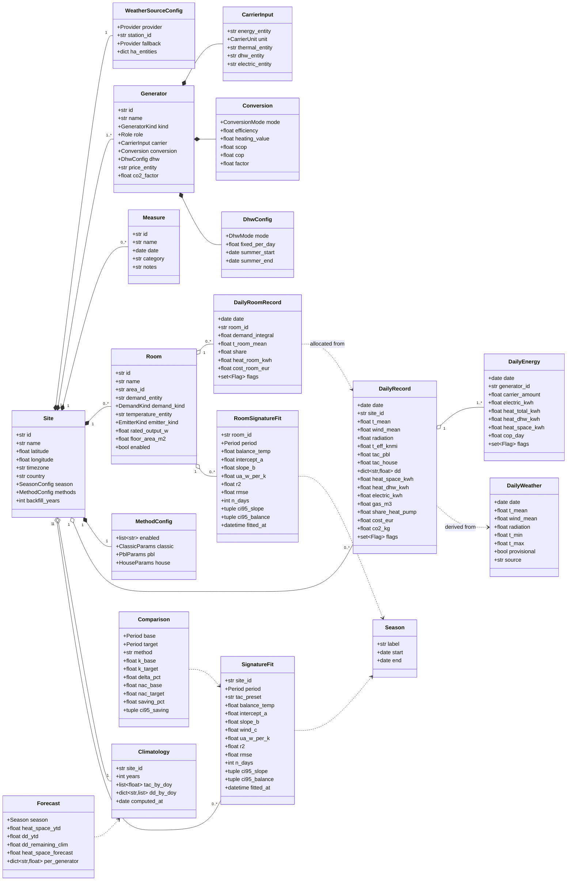

# Data model (DATA_MODEL)

The data model has three layers:

1. **Configuration** - what the user sets up (site, weather source, generators, methods, measures).
   Stored in Home Assistant as a config entry + subentries.
2. **Facts** - calculated daily records and climatology. Stored in Home Assistant as
   external long-term statistics (`heatprint:<site>_<metric>`) plus a compact JSON store for
   fits and flags.
3. **Derived results** - fits, comparisons, forecasts. Calculated on demand or daily, cached.

---

## 1. Configuration entities

### 1.1 Site (config entry)

| Field | Type | Default | Notes |
|---|---|---|---|
| `id` | slug | from `zone.home` name | Used in statistic ids: `heatprint:<id>_...` |
| `name` | str | `zone.home` friendly name, else HA location name, else "Home" | Never asked on first setup |
| `latitude`, `longitude` | float | HA home (not asked on first setup) | For station selection and Open-Meteo |
| `timezone` | str | HA time zone (not asked on first setup) | Day boundaries |
| `country` | ISO-2 | HA country, else tz/coords (not asked on first setup) | Determines the default provider (NL → KNMI) |
| `season.start_month`, `season.start_day` | int | 10, 1 | Heating season/gas year; 1 January possible (mindergas-style calendar year) |
| `methods` | MethodConfig | see 1.5 | |
| `backfill_years` | int 0-10 | 3 | How many years of weather + climatology to fetch at setup |
| `climatology_years` | int | 20 | Reference years for the climatology |
| `weather` | WeatherSourceConfig | | |

### 1.2 WeatherSourceConfig

| Field | Type | Notes |
|---|---|---|
| `provider` | `knmi` / `open_meteo` / `ha_sensors` | |
| `station_id` | str | KNMI station number (e.g. `380` Maastricht); auto-suggested by distance |
| `fallback` | provider or `none` | On outage or outside NL |
| `ha_entities.temperature` | entity_id | Only `ha_sensors` |
| `ha_entities.wind` | entity_id | optional |
| `ha_entities.radiation` | entity_id | optional |

### 1.3 Generator (subentry type `generator`)

| Field | Type | Notes |
|---|---|---|
| `id` | slug | |
| `name` | str | "Gas boiler", "Heat pump" |
| `kind` | `gas_boiler` / `heat_pump` / `electric_heater` / `air_to_air` / `district_heat` / `other` | |
| `role` | `space` / `dhw` / `both` | Hybrid: boiler `both`, heat pump `space` (or `both` if the heat pump does DHW) |
| `carrier.energy_entity` | entity_id | Cumulative meter (m³, kWh, GJ); `state_class total_increasing` |
| `carrier.unit` | `m3` / `kwh` / `gj` | Derived from the sensor, can be overridden |
| `carrier.thermal_entity` | entity_id | Heat pump thermal energy (kWh), optional |
| `carrier.electric_entity` | entity_id | Heat pump electrical energy (kWh); for a heat pump `energy_entity` = electric |
| `carrier.dhw_entity` | entity_id | Measured DHW energy, optional |
| `conversion.mode` | `fixed_efficiency` / `measured_thermal` / `cop_fixed` / `cop_curve` / `factor` | |
| `conversion.efficiency` | float | boiler 0.95; district heating 1.0 |
| `conversion.heating_value` | float | 8.792 (Hs) or 7.92 (Hi) kWh/m³ |
| `conversion.scop` | float | 3.5 |
| `conversion.cop` | float | air_to_air 3.0 |
| `conversion.cop_curve_a`, `conversion.cop_curve_b` | float | 2.2 and 0.08 (`COP = a + b * t_mean`, only with `cop_curve`) |
| `conversion.factor` | float | `other` |
| `dhw.mode` | `measured` / `baseline` / `fixed` / `none` | |
| `dhw.fixed_per_day` | float | in carrier unit |
| `dhw.summer_start`, `dhw.summer_end` | MM-DD | 06-01, 08-31 |
| `price_entity` | entity_id | price per unit (€/m³, €/kWh), optional. Stored; **not read** from the recorder in 0.2.x (F18 / v1.0) |
| `price_mode` | `flat` / `dynamic` | `flat` | Specified for v1.0 (METHODS §13.2). **Not** in the core `Generator` model or config flow yet |
| `co2_factor` | float | kg per unit, default per kind |

### 1.4 Measure (subentry type `measure`)

| Field | Type | Notes |
|---|---|---|
| `name` | str | "Triple glazing", "Flow temperature 45 °C", "Hybrid heat pump" |
| `date` | date | Effective date |
| `category` | `insulation` / `installation` / `behaviour` / `other` | Drives the interpretation text (slope vs. balance point) |
| `notes` | str | |

### 1.5 MethodConfig

| Field | Default | Notes |
|---|---|---|
| `enabled` | `["classic","pbl","house"]` | `knmi14` optional in the UI. All four methods are always calculated **and** stored (ADR 0004); `enabled` plus `primary` choose which method the main sensors and forecast use. Degree-day attributes and statistics still include every method. |
| `classic.base_temp` | 18.0 | |
| `classic.heating_limit` | 18.0 | |
| `classic.weighted` | true | mindergas weighting |
| `classic.t_ref` | `t_mean` | or preset |
| `pbl.parameter_set` | `practical` | or `optimal` |
| `pbl.wind_mode` | `linear` | or `sqrt` (authentic daily KEV-SJV: `T - √W`, coefficient 1.0; see METHODS §3) |
| `pbl.include_sun` | false | |
| `pbl.include_top` | false | |
| `house.fit_wind` | true | |
| `house.tac_weights` | 0.65 / 0.35 | |
| `primary` | `house` | Method for the main sensors and the forecast (falls back to `pbl` as long as no fit exists) |

### 1.6 Room (subentry type `room`)

Optional; a site works fully without any room configured (§12 of METHODS is additive on top of
the existing site-level model, not a prerequisite for it).

| Field | Type | Notes |
|---|---|---|
| `id` | slug | |
| `name` | str | Defaults to the linked HA area's name |
| `area_id` | HA area_id | Link to an HA area. Auto-sync matches on this id (`unique_id` `area:<area_id>`) so rooms are not duplicated when an area is renamed |
| `demand_entity` | entity_id | Sensor/attribute providing the room's heating-demand signal, see METHODS §12.1 |
| `demand_kind` | `percentage` / `valve_position` / `binary` / `metered_energy` | See METHODS §12.1 |
| `temperature_entity` | entity_id | Optional; room temperature for the indicative UA estimate and the room fit's TAC comparison (METHODS §12.4) |
| `emitter_kind` | `radiator` / `underfloor` / `electric` / `other` | Drives the default weight (METHODS §12.2) |
| `rated_output_w` | float | Optional; overrides the `floor_area_m2 * default` weight |
| `floor_area_m2` | float | Optional; used for the default weight and for the per-m² sensors (METHODS §12.4) |
| `volume_m3` | float | Optional; defaults from `floor_area_m2` if unset. Reserved for a future method (ventilation/thermal-mass), unused by any calculation in this version - see METHODS §12.4 |
| `price_entity` | entity_id | Only relevant for `demand_kind: metered_energy`; defaults to the site's DHW-space cost per METHODS §12.5 |
| `enabled` | bool | true | Disabling keeps history but stops daily allocation/fit updates, same convention as removing a `generator` (§CONFIG_FLOW) |

Site options (`options.rooms`):

| Field | Type | Default | Notes |
|---|---|---|---|
| `auto_sync` | bool | true | Create/update room subentries from heated HA areas on setup and reload |
| `exclude_area_ids` | list of area ids | `[]` | Areas that must never become rooms |
| `allocation_enabled` | bool | true | When off, site heat is unchanged and no room statistics are written |

---

## 2. Facts

### 2.1 DailyRecord (one row per site per day)

| Column | Unit | Source |
|---|---|---|
| `date` | local day | |
| `t_mean`, `wind_mean`, `radiation`, `t_min`, `t_max` | °C, m/s, J/cm² | weather provider |
| `t_eff_knmi`, `tac_pbl`, `tac_house` | °C | METHODS §3 |
| `dd.classic`, `dd.classic_unweighted`, `dd.knmi14`, `dd.pbl`, `dd.house` | K·day | METHODS §4 |
| `heat_space_kwh`, `heat_dhw_kwh` | kWh | Σ generators |
| `gas_m3`, `electric_kwh`, `district_gj` | | Σ per carrier |
| `heat_by_generator` | dict | `DailyEnergy` per generator |
| `share_heat_pump` | 0-1 | `Σ Q_space(heat_pump) / heat_space_kwh` |
| `cost_eur`, `co2_kg` | €, kg | optional; METHODS §13 |
| `flags` | set | METHODS §10, §12.7, §13.2, §14 |

### 2.2 Storage in Home Assistant

External statistics (hourly resolution is mandatory in HA; Heatprint writes one hourly record per day at
00:00 local with the daily value, and `sum` for cumulatives):

| statistic_id | type | unit |
|---|---|---|
| `heatprint:<site>_t_mean` | mean | °C |
| `heatprint:<site>_tac_pbl` | mean | °C |
| `heatprint:<site>_tac_house` | mean | °C |
| `heatprint:<site>_dd_classic` | sum | K·d (HA: unit `°C·d` not supported → unit `K`) |
| `heatprint:<site>_dd_knmi14` | sum | K |
| `heatprint:<site>_dd_pbl` | sum | K |
| `heatprint:<site>_dd_house` | sum | K |
| `heatprint:<site>_heat_space` | sum | kWh |
| `heatprint:<site>_heat_dhw` | sum | kWh |
| `heatprint:<site>_heat_<generator>` | sum | kWh (space heating per generator) |
| `heatprint:<site>_heat_dhw_<generator>` | sum | kWh (DHW per generator) |
| `heatprint:<site>_electric_hp` | sum | kWh |
| `heatprint:<site>_gas` | sum | m³ |
| `heatprint:<site>_cost` | sum | € (METHODS §13) — **not written in 0.2.x**; ROADMAP open item 1 |
| `heatprint:<site>_co2` | sum | kg (METHODS §13.3) — **not written in 0.2.x** (core can compute `co2_kg` in-memory when factors are passed) |
| `heatprint:<site>_heat_unallocated` | sum | kWh (METHODS §12.3) |
| `heatprint:<site>_room_<room>_demand` | mean | `%` or `h` depending on `demand_kind` (METHODS §12.1) |
| `heatprint:<site>_room_<room>_heat` | sum | kWh |
| `heatprint:<site>_room_<room>_cost` | sum | € (deferred until site `cost_eur` is written, ROADMAP open item 1) |
| `heatprint:<site>_room_<room>_t_mean` | mean | °C (only if `temperature_entity` is set) |

Advantages: backfill of years is possible, visible in the standard statistics graph card,
survives entity renames, no recorder bloat (1 row/day/metric).

JSON store (`.storage/heatprint.<entry_id>`): `Climatology`, latest `SignatureFit`s,
`dhw_baseline` per generator, per-day `flags` (bitmask), latest `Forecast`, weather
cache (last 400 days), imported readings, `room_fits`, `room_flags`, version.

### 2.3 Climatology

Per site: `tac_preset`, `tac_by_doy[366]`, `wind_by_doy[366]`, `dd_by_doy[method][366]`,
`samples_by_doy[366]`, `years`, `computed_at` (plus, in the HA store, `house_balance_temp`,
the balance temperature with which the `house` series was created). Rebuilt on the first
run of a new calendar year, when the weather source/reference years change and when the
fitted balance temperature changes.

### 2.4 DailyRoomRecord (one row per site per room per day)

See METHODS §12. Only produced for rooms with `enabled: true` and at least one qualifying day.

| Column | Unit | Source |
|---|---|---|
| `date` | local day | |
| `demand_integral` | 0-1 (or kWh for `metered_energy`) | METHODS §12.1 |
| `t_room_mean` | °C | `temperature_entity`, if set |
| `share` | 0-1 | METHODS §12.3 |
| `heat_room_kwh` | kWh | METHODS §12.3 |
| `cost_room_eur` | € | METHODS §12.5 |
| `heat_kwh_per_m2` | kWh/m² | METHODS §12.4; only if `floor_area_m2` is set |
| `flags` | set | METHODS §12.7 |

---

## 3. Derived results

### 3.1 SignatureFit

See METHODS §7. Fields: `balance_temp`, `intercept_a`, `slope_b`, `wind_c`, `ua_w_per_k`,
`r2`, `rmse`, `sse`, `n_days`, `n_heating_days`, `outliers` (dates), `ci95_slope`,
`ci95_balance`, `tac_preset` (`house` or `pbl`), `period`, `fitted_at`. Stored per
(site, period, tac_preset). At most 20 fits per site.

### 3.2 Comparison

See METHODS §8.2-8.4. Not persisted; service response. Too little data →
`InsufficientDataError` → service error with an explanation.

### 3.3 Forecast

See METHODS §8.5. Fields: `season`, `method`, `k_ytd`, `days_ytd`, `days_remaining`,
`last_date`, `heat_space_ytd`, `dd_ytd`, `dd_remaining_clim`, `heat_space_forecast`,
`heat_space_forecast_fit` (optional, from the energy signature), `heat_dhw_forecast`
(remaining DHW), `per_generator`. The season total in the sensors is
`heat_space_forecast + heat_dhw_forecast`. Refreshed daily during the season.

Season labels: `2025/26` for a season start in October or July, `2026` for a start on
1 January. The input `2025/2026` is also accepted.

### 3.4 RoomSignatureFit

See METHODS §12.4. Fields: `balance_temp`, `intercept_a`, `slope_b`, `ua_w_per_k`, `r2`, `rmse`,
`n_days`, `ci95_slope`, `ci95_balance`, `period`, `fitted_at`. Stored per (room, period), same
"at most 20 fits" retention as `SignatureFit`. No `wind_c`/`tac_preset` field: room fits always
use the site TAC (house preset), per METHODS §12.4.

---

## 4. Sensor entities (per site)

`has_entity_name` object ids are slugified from the **UI language** translations,
not from the translation key. On an English UI, `heat_space_yesterday` becomes
`sensor.<site>_space_heating_yesterday`; on a Dutch UI it becomes
`sensor.<site>_ruimteverwarming_gisteren`. The language-stable identifier is
`unique_id = {config_entry.entry_id}_{key}` (same pattern for the
`data_gap` binary sensor). The auto-dashboard (`heatprint.create_dashboard`)
resolves current `entity_id`s from the entity registry by that unique_id; do
not hardcode English object ids when generating Lovelace YAML.

Statistic ids stay on the metric keys (`heatprint:<site>_heat_space`).

The table below shows **English-UI** entity ids as examples.

| Entity | Unit | Class | Notes |
|---|---|---|---|
| `sensor.<site>_effective_temperature` | °C | temperature/measurement | yesterday's TAC (primary preset) |
| `sensor.<site>_degree_days_yesterday` | K | measurement | primary method; attributes: all methods |
| `sensor.<site>_degree_days_season` | K | total | primary method; attributes: all methods, season label |
| `sensor.<site>_space_heating_yesterday` | kWh | energy/total | translation key `heat_space_yesterday` |
| `sensor.<site>_space_heating_season` | kWh | energy/total | translation key `heat_space_season` |
| `sensor.<site>_hot_water_season` | kWh | energy/total | translation key `heat_dhw_season` |
| `sensor.<site>_heat_per_degree_day` | kWh/K | measurement | season to date, primary method; attributes per method |
| `sensor.<site>_gas_per_degree_day` | m³/K | measurement | mindergas-comparable (classic) |
| `sensor.<site>_heat_pump_share_season` | % | measurement | hybrid |
| `sensor.<site>_cop_yesterday` | - | measurement | if measurable |
| `sensor.<site>_heat_loss_coefficient` | W/K | measurement | latest fit |
| `sensor.<site>_balance_temperature` | °C | temperature | latest fit |
| `sensor.<site>_fit_quality` | - | measurement | R² of the latest fit; attributes: n, rmse, CI |
| `sensor.<site>_forecast_heat_season` | kWh | energy | |
| `sensor.<site>_forecast_gas_season` | m³ | gas | |
| `sensor.<site>_forecast_electricity_season` | kWh | energy | translation key `forecast_electric_season` |
| `sensor.<site>_hot_water_baseline` | kWh/day | measurement | translation key `dhw_baseline`; attributes per generator |
| `sensor.<site>_data_quality` | % | measurement | share of usable days in the last 30 days; attributes: flags. `open_health_checks` (METHODS §14) is **v1.0** — not present in 0.2.x |
| `sensor.<site>_last_weather_update` | timestamp | | |
| `binary_sensor.<site>_data_gap` | | problem | > 3 days without usable data |

Data-source health checks (METHODS §14) that fire are specified to open an HA repair
(per generator/room/weather source and failing check) rather than a dedicated entity.
**Not implemented in 0.2.x** (v1.0 / F23). Today only `binary_sensor.<site>_data_gap`
exists.

Per generator: `sensor.<site>_<generator>_space_heating_season`, `..._hot_water_season`,
`..._share_season`, and, only when `price_mode: dynamic` (v1.0 / METHODS §13.2),
`sensor.<site>_<generator>_avg_price_paid` (€/kWh, season-to-date weighted average).
**Not created in 0.2.x.**

Per room (only for rooms with `enabled: true`; a room's "heat" is always space heating only -
DHW is never allocated to rooms, METHODS §12):

| Entity | Unit | Class | Notes |
|---|---|---|---|
| `sensor.<site>_room_<room>_heat_yesterday` | kWh | energy/total | |
| `sensor.<site>_room_<room>_heat_season` | kWh | energy/total | |
| `sensor.<site>_room_<room>_share_season` | % | measurement | share of `heat_space_kwh` allocated to this room |
| `sensor.<site>_room_<room>_cost_season` | € | monetary/total | Not created in 0.2.x — site `cost_eur` is not written as a statistic yet (METHODS §13) |
| `sensor.<site>_room_<room>_heat_loss_coefficient` | W/K | measurement | latest room fit; unavailable while `ROOM_NOT_FITTED` |
| `sensor.<site>_room_<room>_specific_heat_loss` | W/(m²·K) | measurement | `heat_loss_coefficient / floor_area_m2`; only if `floor_area_m2` is set - the figure comparable across rooms and houses (METHODS §12.4) |
| `sensor.<site>_room_<room>_balance_temperature` | °C | temperature | latest room fit |
| `sensor.<site>_room_<room>_fit_quality` | - | measurement | R² of the latest room fit; attributes: n, rmse, CI |
| `sensor.<site>_room_<room>_heat_per_m2_season` | kWh/m² | measurement | only if `floor_area_m2` is set |
| `sensor.<site>_room_<room>_cost_per_m2_season` | €/m² | measurement | only if `floor_area_m2` is set |
| `sensor.<site>_room_<room>_data_quality` | % | measurement | share of usable days in the last 30 days |

Site-level additions for the rooms feature:

| Entity | Unit | Class | Notes |
|---|---|---|---|
| `sensor.<site>_heat_unallocated_season` | kWh | energy/total | METHODS §12.3 |
| `sensor.<site>_cost_space_season` | € | monetary/total | **Deferred** until site `cost_eur` is written (METHODS §13). Not created in 0.2.x |
| `sensor.<site>_most_expensive_room` | - | measurement | State = `room.name` of the room with the highest allocated heat this season (0.2.x ranks by `heat_kwh` until site `cost_eur` exists); attributes: `ranked_by`, `ranking` (enabled rooms with `heat_kwh` and `share`), `by_heat_loss` (same rooms sorted by `ua_w_per_k` desc). Unavailable while no room has a season total yet. |

---

## 5. Services (actions)

| Service | Input | Output |
|---|---|---|
| `heatprint.import_readings` | `entry_id`, `generator_id`, `csv` (text) or `path`, `mapping` (optional; power users), `unit` | number of imported days, gaps. Humans should use **Configure → Import meter readings** (auto-detect + preview). |
| `heatprint.recompute` | `entry_id`, `from_date` | number of days recalculated |
| `heatprint.fit_signature` | `entry_id`, `start`, `end` or `season`, `tac_preset` (`house` or `pbl`), `fit_wind` | `SignatureFit` as response |
| `heatprint.compare_periods` | `entry_id`, `base` (start,end), `target` (start,end), `method` | `Comparison` as response |
| `heatprint.measure_effect` | `entry_id`, `measure_id` | `Comparison` (before/after) |
| `heatprint.forecast` | `entry_id` | `Forecast` |
| `heatprint.export_daily` | `entry_id`, `start`, `end`, `path` | CSV file |
| `heatprint.push_reading` | `entry_id`, `generator_id`, `target: mindergas`, `date` | bridge to the mindergas.nl API (optional, token in options) |
| `heatprint.clear_statistics` | `entry_id`, optional `generator_id` | delete Heatprint external statistics of one generator or the whole site (site clear includes room `*_demand` / `*_t_mean`) |
| `heatprint.fit_room_signature` | `entry_id`, `room_id`, `start`, `end` or `season` | `RoomSignatureFit` as response |
| `heatprint.create_dashboard` | `entry_id` | create or recreate the stock Heatprint overview **and** Rooms Lovelace dashboards in the sidebar |

---

## 6. Derived identifiers and compatibility

- `site.id`, `generator.id` and `room.id` are slugs, unique within the installation; used in
  statistic ids and entity ids. Renaming `name` does not change `id`.
- Version field in the JSON store and config entry (`version`, `minor_version`) for migrations.
- CSV import: humans use **Configure → Import meter readings** (auto-detect). The
  mindergas export `datum;stand` needs no questions. The service still accepts an
  optional `mapping` (column names, date format `%d-%m-%Y` / ISO, decimal separator).
